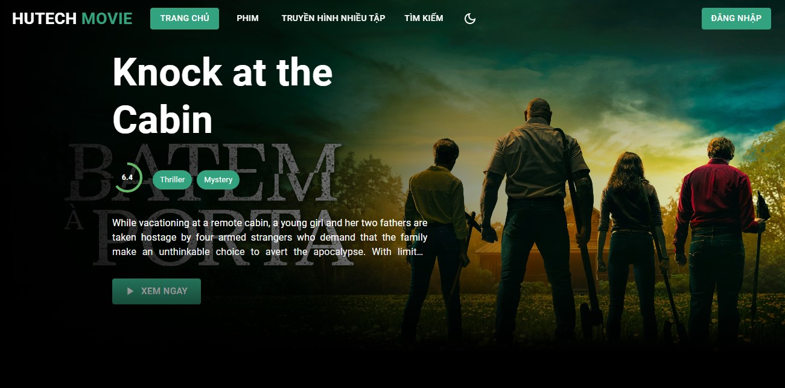

# MERN-STACK-MOVIE-PROJECT-2023


#### Giới thiệu
web client

## Sử dụng
- [Create React App](https://create-react-app.dev/): là một công cụ dùng để tạo một ứng dụng React mới một cách nhanh chóng và đơn giản. Nó cung cấp các cấu hình mặc định và các tiện ích để phát triển ứng dụng React một cách hiệu quả.
- [Material UI](https://mui.com/): là một thư viện giao diện người dùng cho React, nó cung cấp một bộ các thành phần UI được thiết kế theo phong cách Material Design của Google, giúp tăng tốc độ phát triển và cải thiện trải nghiệm người dùng.
- [Mongoose](https://mongoosejs.com/): là một thư viện JavaScript cho phép tương tác với MongoDB thông qua các mô hình đối tượng (Object Document Mapper), giúp đơn giản hóa việc lưu trữ, tìm kiếm và truy xuất dữ liệu từ cơ sở dữ liệu MongoDB.
- [Express](https://expressjs.com/): là một framework JavaScript cho phép phát triển các ứng dụng web và API một cách nhanh chóng và dễ dàng, nó cung cấp các tính năng như routing, middleware, và phân tích các yêu cầu HTTP.
- [Express Validator](https://express-validator.github.io/docs/): là một thư viện validator middleware cho ExpressJS, giúp xác thực dữ liệu đầu vào của người dùng, giúp đảm bảo tính toàn vẹn dữ liệu và tăng cường bảo mật cho ứng dụng.
- [React Router](https://reactrouter.com/en/main): là một thư viện JavaScript cho phép điều hướng trang cho ứng dụng React, giúp phát triển ứng dụng có tính tương tác cao và cải thiện trải nghiệm người dùng.
- [Formik](https://formik.org/): là một thư viện React cho phép quản lý và xử lý các biểu mẫu (form), giúp đơn giản hóa việc xử lý dữ liệu đầu vào của người dùng và tăng cường tính tương tác của ứng dụng.
- [Yup](https://github.com/jquense/yup):  là một thư viện JavaScript cho phép xác thực dữ liệu đầu vào, giúp đảm bảo tính toàn vẹn dữ liệu và tăng cường bảo mật cho ứng dụng.
- [Axios](https://axios-http.com/):  là một thư viện JavaScript cho phép tương tác với các API, giúp lấy và gửi dữ liệu giữa ứng dụng và server, tăng cường tính tương tác của ứng dụng.

#### Front end
    +) Create react app
    +) Material UI
    +) SwiperJS
    +) React router v6
    +) Formik
    +) Yup
    +) Axios

## Hướng dẫn khởi chạy dự án
```
cd client
yarn install
yarn start
```